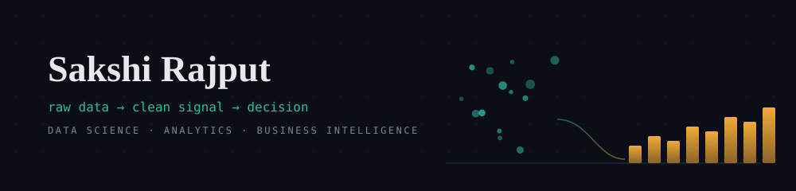
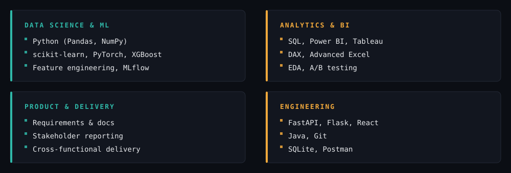

 

## About

I work across the full data lifecycle — cleaning and wrangling raw data, building and evaluating ML models (regression, trees, ensembles), and turning all of it into dashboards and reports stakeholders actually act on. Equally comfortable in a notebook running cross-validation as I am in Power BI writing a DAX measure, or scoping how a feature/pipeline should even be structured in the first place.

B.Tech in Computer Science (GPA 8.9/10). Currently a Data Science Trainee at Chetu Inc., with prior experience spanning government (DRDO), healthcare (Care Health Insurance), and QA (Skilrock).

 

## Featured Work

<table>
<tr>
<td width="50%" valign="top">

**🗂️ [One Source of Truth — Data Automation](https://github.com/SakshiiRajputt/One-Source-of-Truth-)**
Consolidated 3 messy, inconsistent people-datasets (105 rows) into a single SQLite source of truth — entity resolution without a shared ID, a FastAPI service, an n8n automation workflow, and a Streamlit app. 63 canonical people resolved from 104 source records with a documented data-quality report.

`FastAPI` `SQLite` `n8n` `Streamlit` `Entity Resolution`

</td>
<td width="50%" valign="top">

**🧠 [Alzheimer's Detection — Published Research](https://github.com/SakshiiRajputt/Synergizing-3D-EfficientNet-and-XGBoost-for-Early-Alzheimer-s-Detection)**
Multimodal deep learning fusing 3D EfficientNet (MRI) with XGBoost (clinical data) for early diagnosis, with Grad-CAM + SHAP interpretability. Published in *Grenze International Journal of Engineering and Technology*, Jan 2026.

`PyTorch` `XGBoost` `SHAP` `Grad-CAM`

</td>
</tr>
<tr>
<td width="50%" valign="top">

**📉 [Model Drift Detection — Evidently AI](https://github.com/SakshiiRajputt/model-drift-evidently)**
Trained a classifier, simulated realistic production drift (noise, feature shift, label flipping), then used Evidently AI to detect it — accuracy dropped from 94.7% to 83.6% post-drift, with the tool correctly flagging the exact 3 shifted features. Includes a Logistic Regression vs. Random Forest robustness comparison.

`scikit-learn` `Evidently AI` `MLOps`

</td>
<td width="50%" valign="top">

**🔬 [MLflow Experiment Tracking — Iris](https://github.com/SakshiiRajputt/MLFlow-Iris-Classifier)**
Tracked 15 experiment runs across 6 model types (Logistic Regression, Decision Tree, Random Forest, KNN, SVM, Naive Bayes) with MLflow — logged params, metrics, and artifacts, then compared runs to select the most consistently strong model.

`MLflow` `scikit-learn` `Experiment Tracking`

</td>
</tr>
<tr>
<td width="50%" valign="top">

**💊 [VitalSense — Health Risk Dashboard](https://github.com/SakshiiRajputt/vitalsense)**
Full-stack CRUD app for patient blood-test records with a live-search stats dashboard and rule-based, colour-coded risk flags against clinical thresholds.

`Predictive Modeling` `Health-Tech`

</td>
<td width="50%" valign="top">

**📊 Flipkart Mobile Market Dashboard**
Power BI dashboard with DAX measures for discount %, price-to-rating ratio, and brand-wise pricing strategy, with scatter/combo visuals linking device specs to price.

`Power BI` `DAX`

</td>
</tr>
</table>

 

## Experience

| | | |
|---|---|---|
| **Chetu Inc.** — Data Science Trainee | *Feb '26 – Present* | Built and evaluated ML models (Regression, Decision Trees, Random Forest, KNN, SVM) with feature engineering and cross-validation; EDA and stakeholder-facing reporting |
| **Skilrock Technologies** — QA Intern | *Nov '25 – Feb '26* | SQL-based data integrity validation; test case design and regression testing; QA reports used directly in release decisions |
| **DRDO** — Full Stack Dev Intern | *Oct '24 – Jan '25* | Built a React + Flask analytics dashboard with KPI/trend charts and REST APIs; automated data-prep workflows |
| **Care Health Insurance** — Data Scientist Intern | *Jul '24 – Aug '24* | Applied predictive modeling to healthcare datasets; built Power BI/Excel dashboards for senior stakeholders; **cut reporting effort by ~30%** through automation |

 

## Stack

 

🎓 Education & Certifications

 

**B.Tech, Computer Science & Engineering** — JIMS Engineering Management Technical Campus (GGSIPU) · GPA 8.9/10

- From Learner to Builder: Become an AI Agent Architect — *IBM SkillsBuild*
- IBM Granite Models for Software Development — *IBM SkillsBuild*
- Introduction to Data Science and Artificial Intelligence — *LinkedIn Learning*
- Java 11 and Java Object-Oriented Programming — *LinkedIn Learning*

 

  

**📫 Open to Data Science / Data Analyst / BI roles and research collaborations**

